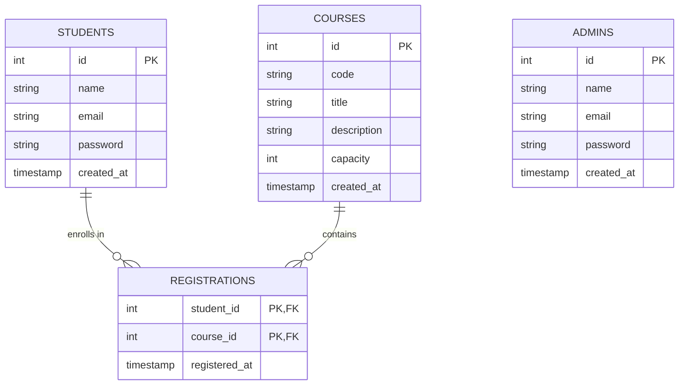

# Student Course Registration System

A web-based student course registration system built for a college mini-project / portfolio project. This application uses the **React + Express + Node + MySQL** stack.

## Tech Stack
*   **Frontend**: React (Vite), React Router, Axios, CSS (Vanilla or Tailwind)
*   **Backend**: Node.js, Express.js
*   **Database**: MySQL
*   **Authentication**: JWT (JSON Web Tokens) & Bcrypt (password hashing)

---

## Directory Structure
```text
├── client/                     # React Frontend (Vite)
├── server/                     # Node.js + Express Backend
│   ├── .env.example            # Environment template file
│   └── .env                    # Real environment variables
├── course_registration_designs/ # UI Wireframes & designs
├── package.json                # Root package for running client/server concurrently
└── README.md                   # This documentation file
```

---

## Database Design & ER Diagram

The database uses a normalized relational schema with 4 main tables:

### 1. `admins`
Stores administrator accounts that can create, update, delete courses and view enrollments.
*   `id` (INT, Primary Key, AUTO_INCREMENT)
*   `name` (VARCHAR(100), NOT NULL)
*   `email` (VARCHAR(100), UNIQUE, NOT NULL)
*   `password` (VARCHAR(255), NOT NULL)
*   `created_at` (TIMESTAMP, DEFAULT CURRENT_TIMESTAMP)

### 2. `students`
Stores student accounts that can view available courses and register for them.
*   `id` (INT, Primary Key, AUTO_INCREMENT)
*   `name` (VARCHAR(100), NOT NULL)
*   `email` (VARCHAR(100), UNIQUE, NOT NULL)
*   `password` (VARCHAR(255), NOT NULL)
*   `created_at` (TIMESTAMP, DEFAULT CURRENT_TIMESTAMP)

### 3. `courses`
Stores details of the courses offered in the system.
*   `id` (INT, Primary Key, AUTO_INCREMENT)
*   `code` (VARCHAR(20), UNIQUE, NOT NULL) — e.g. "CS101", "CSE-401"
*   `title` (VARCHAR(150), NOT NULL)
*   `description` (TEXT)
*   `capacity` (INT, NOT NULL) — seat limit
*   `created_at` (TIMESTAMP, DEFAULT CURRENT_TIMESTAMP)

### 4. `registrations`
A junction table representing the many-to-many relationship between `students` and `courses` (i.e. course enrollment).
*   `student_id` (INT, Foreign Key referencing `students(id)` ON DELETE CASCADE)
*   `course_id` (INT, Foreign Key referencing `courses(id)` ON DELETE CASCADE)
*   `registered_at` (TIMESTAMP, DEFAULT CURRENT_TIMESTAMP)
*   *Composite Primary Key*: `(student_id, course_id)`

### ER Diagram Relationship


---

## How to Setup and Run

### Prerequisites
*   Node.js (v16+)
*   MySQL Server running locally

### Installation & Run

1.  **Clone the Repository**
2.  **Configure environment variables**:
    Copy `server/.env.example` to `server/.env` and edit with your MySQL database credentials:
    ```bash
    cp server/.env.example server/.env
    ```
3.  **Install dependencies and start development servers**:
    From the project root:
    ```bash
    npm run install:all
    npm run dev
    ```
